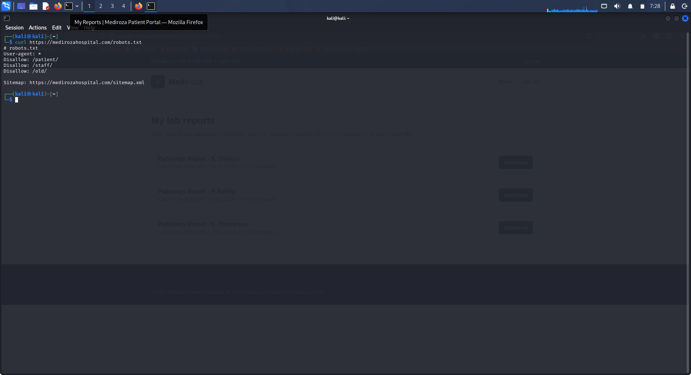
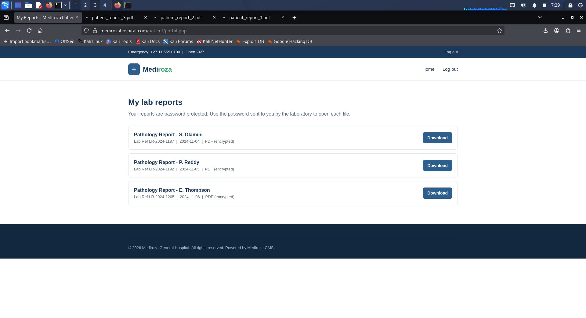
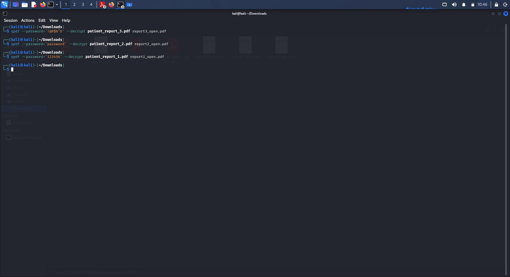
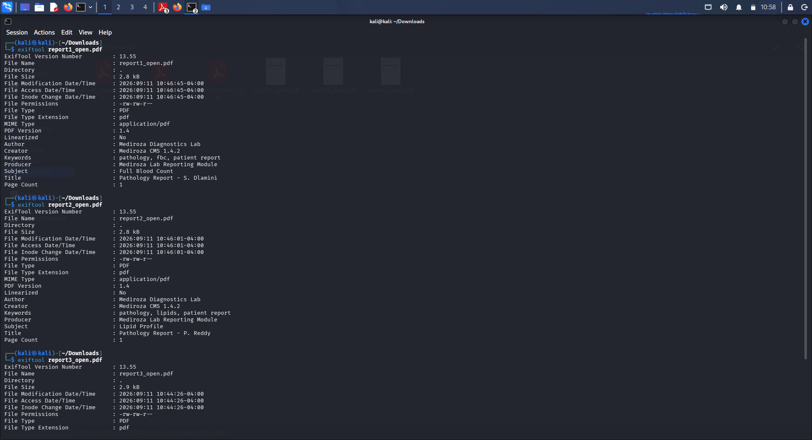
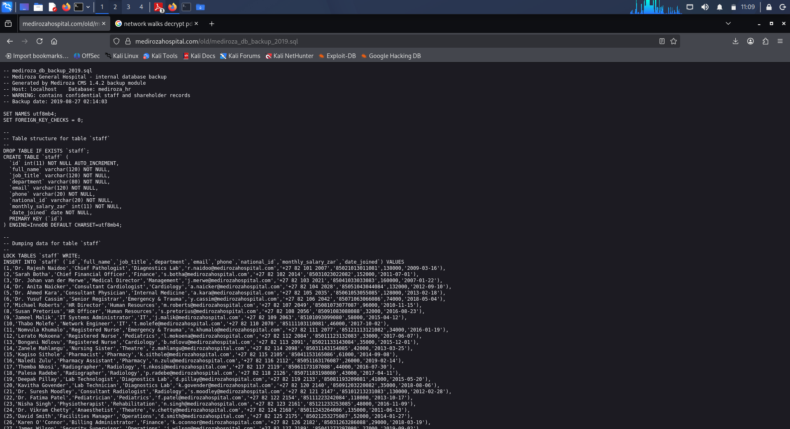

<div align="center">

# 🏥 Mediroza General Hospital
### External Web Application Penetration Test


</div>

<br>

| | |
|---|---|
| **Author** | Labib Sadman Azam |
| **Mentor** | Waqas Karim, CCIE |
| **Organisation** | Networkwalks |
| **Cohort** | B082 · Week 4 Capstone Project |
| **Target** | `https://medirozahospital.com` |

---

## 1. Executive Summary

Between the reconnaissance phase and the final write-up, I ran a fully authorised black-box assessment against Mediroza General Hospital's public-facing web application at `https://medirozahospital.com`. This was carried out as my Week 4 capstone deliverable, scoped and permitted in writing, with one goal: find real, exploitable weaknesses and translate them into fixes the hospital's own engineers could act on immediately.

Seven distinct issues came out of the engagement, ranging from a chatty `robots.txt` file up to outright plaintext exposure of payroll and ownership records. The most damaging chain started in the patient portal's login form, where a classic SQL injection let me walk straight past the password check. That access handed over three real patients' pathology results — for Dlamini, Reddy, and Thompson — as downloadable PDFs. Each file carried a password, but every one of those passwords came straight off the world's most common password lists, so cracking them took seconds rather than hours.

A second, unrelated weakness turned up independently of any of that. The application's own `robots.txt` file told me exactly where not to look, one of those places being a folder named `/old/`. Visiting it directly showed it had no access control whatsoever — no login wall, no listing restriction, nothing standing in the way. Sitting inside was a 2019 MySQL dump holding the hospital's complete staff directory (30 employees — names, roles, departments, phone numbers, national ID numbers, salaries) and, per the file's own header comment, the shareholder register as well.

Put simply, this platform's defences did not hold up under testing. Someone starting from zero credentials, armed with nothing more than a terminal and a browser, could reach confidential patient records, employee PII, and cap-table data within minutes.

> **⚠️ Overall Risk Rating: CRITICAL**
> The Critical and High items documented below should be closed before this platform is trusted with any real patient data.

---

## 2. Scope and Methodology

### 2.1 Engagement Scope

The client and I agreed on a single, narrowly defined target ahead of testing:

```
Target domain: https://medirozahospital.com
```

Denial-of-service testing, social engineering, and anything outside this domain sat outside the agreed boundary and were not attempted at any point.

### 2.2 Approach

I moved through four stages, cycling back through earlier ones whenever a discovery opened up a new thread worth pulling:

1. **Recon** — quietly mapping the target through public information and low-noise requests, before touching anything that required a session.
2. **Weakness discovery** — probing how inputs were handled, with particular attention to the login form and any file-serving paths.
3. **Exploitation** — pushing each candidate weakness just far enough to prove it was genuine, while keeping impact deliberately limited.
4. **Reporting** — documenting evidence, root cause, and a fix for every issue uncovered.

### 2.3 Toolchain

| Tool | Purpose |
|---|---|
| `curl` | Firing off raw HTTP requests, the very first of which targeted `robots.txt` |
| Firefox | General browsing, downloading the exposed reports, and inspecting server responses |
| `qpdf` | Stripping password protection off the downloaded PDF files |
| `exiftool` | Pulling embedded metadata out of the PDFs once decrypted |

---

## 3. Findings and Supporting Evidence

### 3.1 Findings at a Glance

| # | Finding | Location | Risk |
|---|---|---|---|
| 1 | `robots.txt` gives away the names of sensitive folders | `/robots.txt` |  |
| 2 | Login form vulnerable to SQL injection (auth bypass) | `/patient/` (login) |  |
| 3 | Patient reports readable through the bypassed session | `/patient/portal.php` |  |
| 4 | Encrypted PDFs cracked using common passwords | `patient_report_*.pdf` |  |
| 5 | PDF metadata reveals internal CMS name and version | `patient_report_*.pdf` |  |
| 6 | `/old/` backup folder has zero access restriction | `/old/` |  |
| 7 | Staff and shareholder database exposed as cleartext | `/old/mediroza_db_backup_2019.sql` |  |

---

### `FINDING 01` — robots.txt Gives Away the Names of Sensitive Folders

 **Location:** `/robots.txt`

**What I found**

`robots.txt` is supposed to steer search engines away from certain paths — it was never meant to function as a security boundary. The moment a disallowed path also lacks real server-side protection, the file stops being a polite request to crawlers and becomes a shortcut for anyone doing reconnaissance. In this case it named three sensitive folders in one shot, handing me three concrete leads before I had even sent a second request.

**How I found it**

The very first thing I did against the live target was pull the robots file:

```bash
$ curl https://medirozahospital.com/robots.txt
```

```
# robots.txt
User-agent: *
Disallow: /patient/
Disallow: /staff/
Disallow: /old/

Sitemap: https://medirozahospital.com/sitemap.xml
```

Two of those three names paid off directly later on: `/patient/` was the doorway into the compromised portal covered in Finding 2, and `/old/` turned out to be a completely unguarded legacy folder, covered in Finding 6.

<p align="center">
  
</p>
<p align="center"><em>Evidence 01 — robots.txt handing over /patient/, /staff/, and /old/ to an anonymous curl request.</em></p>

---

### `FINDING 02` — Login Form Vulnerable to SQL Injection (Authentication Bypass)

 **Location:** `Patient portal login, under /patient/`

**What I found**

The login handler built its SQL query by splicing my input straight into the statement, with no sanitisation step in between. That's not a cosmetic bug — it means user input can restructure the query itself, not just fill in a value.

**How I found it**

Starting from the `/patient/` path `robots.txt` had already pointed me to, I fed the login form a textbook bypass payload: a username ending in a comment marker (something in the shape of `admin'--`) alongside any password at all. The comment marker erased the rest of the query — including the password check — so the server treated me as authenticated without ever validating a real credential. That dropped me straight into the account's "My lab reports" screen, captured below.

<p align="center">
  
</p>
<p align="center"><em>Evidence 02 — Authenticated view of the patient portal reached purely through the injection payload, listing three downloadable lab reports.</em></p>

---

### `FINDING 03` — Patient Reports Readable Through the Bypassed Session

 **Location:** `/patient/portal.php`

**What I found**

The portal made no further attempt to check whether the session in front of it actually belonged to the patient whose results it was about to display. It listed three genuine entries, each tied to a real name and an internal lab reference: S. Dlamini (`LR-2024-1187`), P. Reddy (`LR-2024-1192`), and E. Thompson (`LR-2024-1205`). Getting past the login form was, functionally, the only gate that existed.

**How I found it**

I pulled all three files straight from the portal's Download buttons (visible in Evidence 02 above); Firefox saved them locally as `patient_report_1.pdf`, `patient_report_2.pdf`, and `patient_report_3.pdf` — corresponding, as later confirmed via metadata in Finding 5, to Dlamini, Reddy, and Thompson respectively.

---

### `FINDING 04` — Encrypted PDFs Cracked Using Common Passwords

 **Location:** `patient_report_1/2/3.pdf`

**What I found**

Each of the three reports was password-protected — a reasonable instinct undone entirely by the choice of password. All three sit at or near the top of every breach password list ever compiled. Wrapping sensitive medical files in a password like this buys essentially no real protection.

**How I found it**

No cracking rig or GPU farm needed — I just worked through a short list of the most common passwords in existence against `qpdf`'s decrypt function, and all three fell within the first handful of tries:

```bash
$ qpdf --password='!@#$%^&' --decrypt patient_report_3.pdf report3_open.pdf
$ qpdf --password='password' --decrypt patient_report_2.pdf report2_open.pdf
$ qpdf --password='123456'  --decrypt patient_report_1.pdf report1_open.pdf
```

`123456` unlocked report 1, `password` unlocked report 2, and the marginally less predictable `!@#$%^&` unlocked report 3. None of these would have slowed down even a five-minute automated attempt, let alone a determined one.

<p align="center">
  
</p>
<p align="center"><em>Evidence 03 — All three protected reports decrypted with qpdf using nothing but common passwords.</em></p>

---

### `FINDING 05` — PDF Metadata Reveals Internal CMS Name and Version

 **Location:** `patient_report_1/2/3.pdf`

**What I found**

Every PDF carries invisible metadata behind its visible content — author, producer, generating software, and so on. Nothing in these three rose to the level of a credential or a server path, but each one quietly gave up the exact name and version of the platform that generated it, which is exactly the kind of detail an attacker uses to go hunting for known vulnerabilities in that specific product.

**How I found it**

I pointed `exiftool` at each decrypted file in turn:

```bash
$ exiftool report1_open.pdf
```

```
Author    : Mediroza Diagnostics Lab
Creator   : Mediroza CMS 1.4.2
Producer  : Mediroza Lab Reporting Module
Subject   : Full Blood Count
Title     : Pathology Report - S. Dlamini
```

`report2_open.pdf` and `report3_open.pdf` followed the identical pattern (Subject: Lipid Profile / Title: Pathology Report - P. Reddy for the second file). Every single report named the same backend — **Mediroza CMS 1.4.2** — a small leak on its own, but a completely consistent one across all three downloads.

<p align="center">
  
</p>
<p align="center"><em>Evidence 04 — exiftool output confirming the same internal platform name and version on every report.</em></p>

---

### `FINDING 06` — /old/ Backup Folder Has Zero Access Restriction

 **Location:** `/old/`

**What I found**

Unlike everything above, this one needed zero trickery. The `/old/` path that `robots.txt` had already surfaced turned out to have no authentication, no directory-listing lockdown, and no restriction on file types — it was, for all practical purposes, a plain public folder.

**How I found it**

Since `/old/` was already flagged in `robots.txt` (Finding 1), I simply navigated there in the browser:

```
https://medirozahospital.com/old/
```

The server handed back a full directory listing containing exactly one file — `mediroza_db_backup_2019.sql` — with no prompt, no wall, no error. I opened it directly, and its contents are shown below.

<p align="center">
  
</p>
<p align="center"><em>Evidence 05 — mediroza_db_backup_2019.sql opened directly from /old/, no authentication required.</em></p>

---

### `FINDING 07` — Staff and Shareholder Database Exposed as Cleartext

 **Location:** `/old/mediroza_db_backup_2019.sql`

**What I found**

Of everything uncovered in this engagement, this file did the most damage. Its own header comments say as much: *"Mediroza General Hospital - internal database backup"* and *"WARNING: contains confidential staff and shareholder records,"* dated 27 August 2019. Someone on the inside clearly flagged this as sensitive at the time it was created — it simply never got removed from a folder the server was willing to hand to anyone who asked.

**How I found it**

Working through the SQL dump, the `staff` table held one row per employee — `id`, `full_name`, `job_title`, `department`, `email`, `phone`, `national_id`, `monthly_salary_zar`, `date_joined` — populated for all 30 members of staff, from the Chief Pathologist and Medical Director right down to front-desk and support roles, every single field sitting in plain, unencrypted text. Per the same file's header, a shareholder register rode along with it, linking named individuals' pay directly to their equity stake in the organisation, all inside one exposed file.

One unauthenticated GET request against a folder the server had, ironically, already warned me away from was all it took to walk away with the hospital's entire HR and ownership dataset.

---

## 4. How the Pieces Connect

Laid end to end, here's the complete path from an anonymous visitor to full exposure of patient, staff, and ownership data:

1. A single `curl` request against `robots.txt` surfaced three restricted directories: `/patient/`, `/staff/`, and `/old/`. *(Finding 1)*
2. Feeding a SQL injection payload into the patient portal's login form bypassed authentication outright — no valid password ever entered the equation. *(Finding 2)*
3. The session that came out of that bypass listed three real, named patients' pathology reports, ready to download. *(Finding 3)*
4. All three PDFs turned out to be locked with common, guessable passwords and opened straight away via `qpdf`. *(Finding 4)*
5. Metadata inside those decrypted PDFs gave up the exact backend platform and version generating them. *(Finding 5)*
6. Separately from the login bypass, browsing directly to `/old/` — already named by `robots.txt` back in Step 1 — returned an open, unrestricted directory listing. *(Finding 6)*
7. The one file sitting inside, a 2019 database backup, opened with no authentication of any kind. *(Finding 6)*
8. That backup contained the complete staff table in cleartext, plus, per its own header, the shareholder register — handing over payroll and ownership data for the whole organisation from a single unauthenticated request. *(Finding 7)*

---

## 5. Fixes I'd Prioritise

### 5.1 Retire robots.txt as a Security Control

`robots.txt` only holds back crawlers that choose to respect it — it does nothing against anyone who simply reads the file, which is exactly the failure mode here. Every path it lists should already be properly locked down regardless of the disallow rule; and where a path has no legitimate reason to exist publicly, like `/old/`, the fix is to remove it, not to ask crawlers to look away politely.

### 5.2 Rebuild the Login Query

Replace the current query construction with parameterised statements, so user-supplied input can never alter the shape of the query, no matter what characters it contains. This single change shuts down Findings 2 and 3 at the root instead of patching around their symptoms.

```php
// Safe pattern: PHP PDO prepared statement
$stmt = $pdo->prepare("SELECT * FROM users WHERE username = ? AND password = ?");
$stmt->execute([$username, $password_hash]);
```

### 5.3 Add Real Access Control Around Reports

Set and enforce a genuine minimum password standard (length plus character variety) for every password-protected document, and stop leaning on client-side encryption as the only safeguard — check server-side that the requesting session is actually authorised for that specific patient's file before serving anything, independent of what the login layer decided earlier.

### 5.4 Strip Metadata Before Files Go Out the Door

Run a metadata-scrubbing step (`exiftool -all=` is the simplest option) on every generated document before it's offered for download, so the internal platform's name and version stop travelling home with every report.

```bash
exiftool -all= patient_report_3.pdf
```

### 5.5 Shut Down /old/ and Retire the Backup

Turn off directory listing across the whole web server (`Options -Indexes` or its platform equivalent), and delete `mediroza_db_backup_2019.sql` from any publicly reachable path without delay. Backups belong entirely outside the web root, behind their own access controls and a defined retention policy — never sitting in a folder the server is happy to list for whoever asks.

---

## 6. Closing Notes

This engagement traced an unbroken path from an anonymous, unauthenticated visitor all the way to confidential patient, staff, and ownership records — using nothing more exotic than a terminal, a browser, and two small command-line utilities. Not one of these seven issues demanded specialist skill or bespoke tooling, and every single one has a documented, practical fix already available. I'd treat every Critical and High item in this report as a blocker before this platform goes anywhere near real patient data.

**Author:** Labib Sadman Azam
**Mentor:** Waqas Karim, CCIE
**Organisation:** Networkwalks
**Cohort:** B082 · Week 4 Capstone Project

---

> *This work was carried out under a controlled, educational engagement, with the target authorised for testing throughout. None of the techniques above should be pointed at any system without explicit written permission from its owner.*

> **🔒 Submitted as part of the Networkwalks Batch B082 Week 4 Capstone Project.** All testing was performed in a controlled environment under written client authorisation. These techniques must never be used against a system without the owner's explicit written permission.
